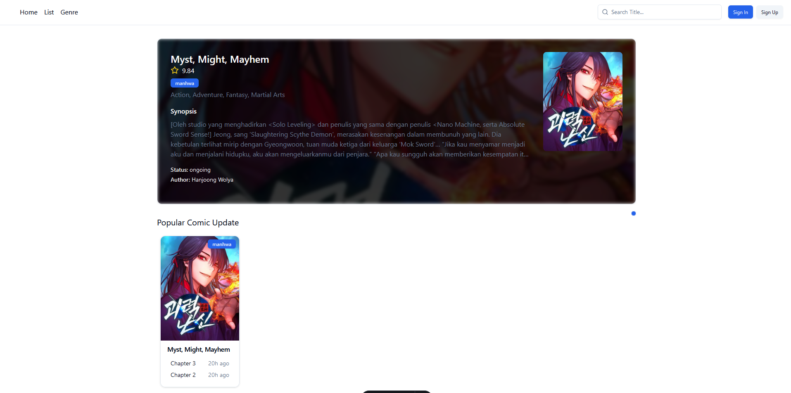
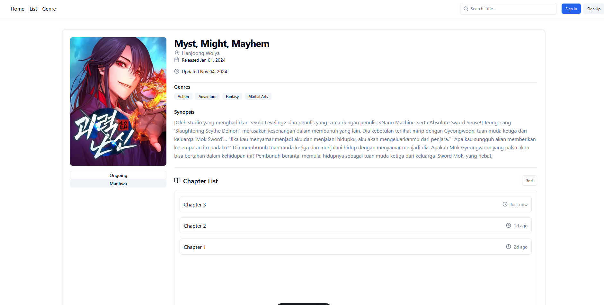
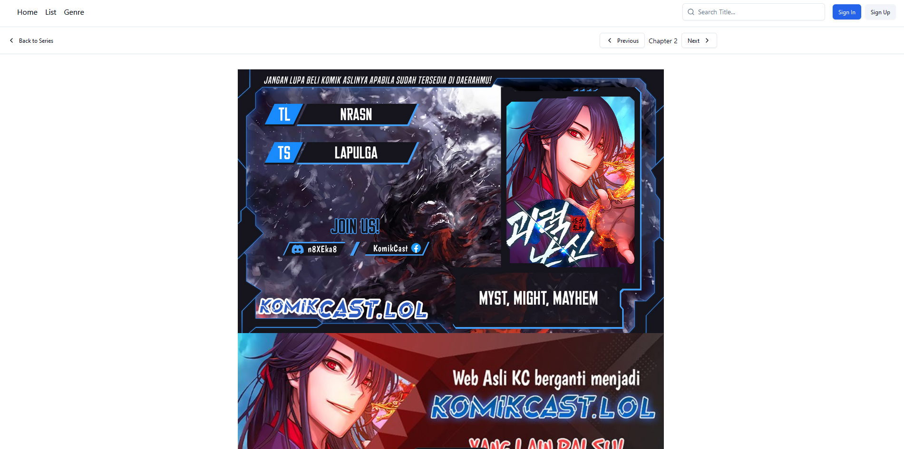

#  Komikr

> A simple comic website

## 🚀 Project Overview
Komikr is an web project built to learn Astro, using Shadcn components to create a seamless, stylish comic reading experience. The site fetches comic data from Komikcast, presenting it in a clean, user-friendly interface. This project is intended for educational purposes and is not meant for commercial use.

for now it's just scrape 1 comic and just 3 chapter :D

## 📸 Demo

## ⚙️ Tech Stack
* Frontend: [Astro] - Static site generation for fast, minimal websites.
* Components: [Shadcn] - Styled component library for a cohesive look.
* Backend: [Node.js] - For the scraping logic and API endpoints.
* Scraping: [Cheerio] - For fetching and parsing comic data from Komikcast.
* Styling: [Tailwind CSS] - For a responsive and modern UI.

## 🤝 Contributing
Contributions are welcome! To contribute, fork the repository, create a new feature branch, and submit a pull request. Any feedback or improvements are appreciated!
